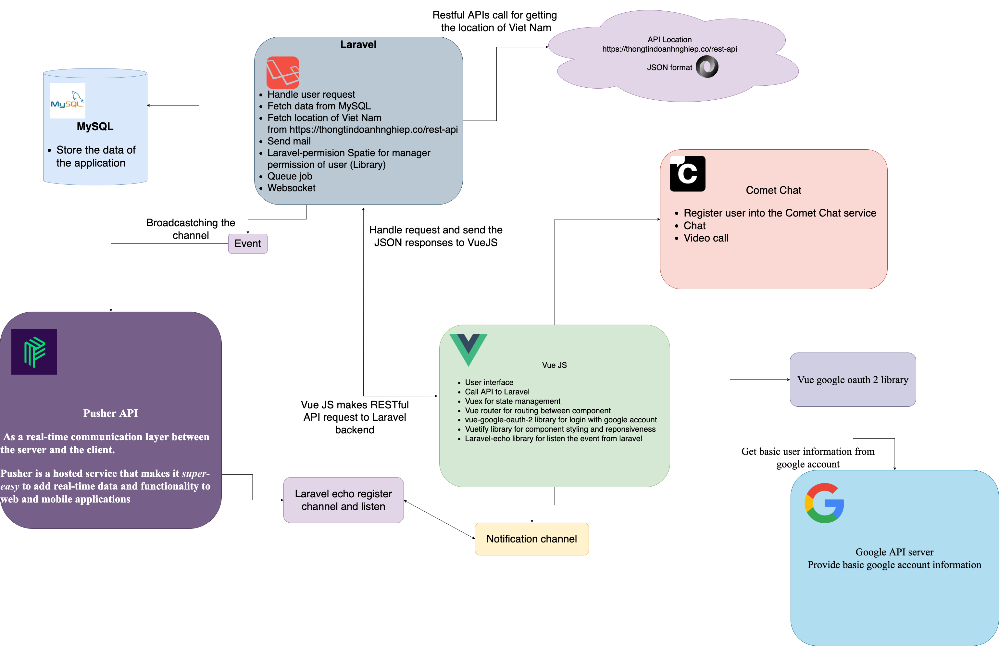

# Healthy social website

#### Author: Tran Ngoc Phuoc - Fullstack developer

#### Contract me: phuoctn412@gmail.com

### This source code is client-side for display the user interface

### Back-end Laravel repository is here [Healthy social](https://github.com/FPT-Greenwich-University/server-api-healthy-forum "Laravel project")

# Application Architecture



# Demonstration

1. [Posts view page](project-introduce/images/posts.png)
2. [Create post view page](project-introduce/images/create-posts.png)
3. [Search post view page](project-introduce/images/search-posts.png)
4. [Search user view page](project-introduce/images/search-users.png)
5. [Chat and video call view page](project-introduce/images/chat-videocall.png)
6. [Favorite doctor list view page](project-introduce/images/favorite-doctor-list.png)
7. [Favorite post list view page](project-introduce/images/favorite-post.png)
8. [Profile view page](project-introduce/images/profiles.png)

# client-paginate

## Project setup

```
npm install
```

### Compiles and hot-reloads for development

```
npm run serve
```

### Compiles and minifies for production

```
npm run build
```

### Customize configuration

See [Configuration Reference](https://cli.vuejs.org/config/).

### Project using vuetify and for reusable pagination component, i using event listener (vm.$emit), currentPage state and lastPage state is store in index.js (store).

### Important: using only using computed to get and set currentPage, get lastPage can be using mapState() from vuex. Using watcher on currenPage state to call event method and call back asynchronous method fetch resrouce of backend side and re-render it again in state of vuex.

### You can prop only last_page in paginate component and must have listen event callback.